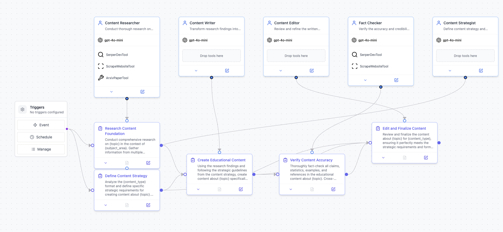

# MultiAgentContentCreationSystem Crew


Welcome to the MultiAgentContentCreationSystem Crew project, built using [crewAI](https://crewai.com). This project leverages the powerful and flexible crewAI framework to create a multi-agent system that enables agents to collaborate effectively on complex content creation tasks, maximizing their collective intelligence and capabilities.



## Installation

Ensure you have Python >=3.10 <3.14 installed on your system. This project uses [UV](https://docs.astral.sh/uv/) for dependency management and package handling, offering a seamless setup and execution experience.

First, if you haven't already, install uv:

```bash
pip install uv
```

Next, navigate to your project directory and install the dependencies:

(Optional) Lock the dependencies and install them by using the CLI command:
```bash
crewai install
```
### Customizing

**Add your `OPENAI_API_KEY` into the `.env` file**

- Modify `src/multi_agent_content_creation_system/config/agents.yaml` to define your agents
- Modify `src/multi_agent_content_creation_system/config/tasks.yaml` to define your tasks
- Modify `src/multi_agent_content_creation_system/crew.py` to add your own logic, tools and specific args
- Modify `src/multi_agent_content_creation_system/main.py` to add custom inputs for your agents and tasks

## Running the Project

To kickstart your crew of AI agents and begin task execution, run this from the root folder of your project:

```bash
$ crewai run
```

This command initializes the multi_agent_content_creation_system Crew, assembling the agents and assigning them tasks as defined in your configuration.

This example, unmodified, will run the create a `report.md` file with the output of a research on LLMs in the root folder.

## Understanding Your Crew

The multi_agent_content_creation_system Crew is composed of multiple AI agents, each with unique roles, goals, and tools. These agents collaborate on a series of tasks, defined in `config/tasks.yaml`, leveraging their collective skills to achieve complex objectives. The `config/agents.yaml` file outlines the capabilities and configurations of each agent in your crew.

## Support

This project was built using [crewAI](https://crewai.com). For support, questions, or feedback:

**For crewAI framework:**
- Visit the [crewAI documentation](https://docs.crewai.com)
- Reach out through the [crewAI GitHub repository](https://github.com/joaomdmoura/crewai)
- [Join the crewAI Discord](https://discord.com/invite/X4JWnZnxPb)
- [Chat with the crewAI docs](https://chatg.pt/DWjSBZn)

**For this project:**
- Please refer to the crewAI documentation and community resources above
